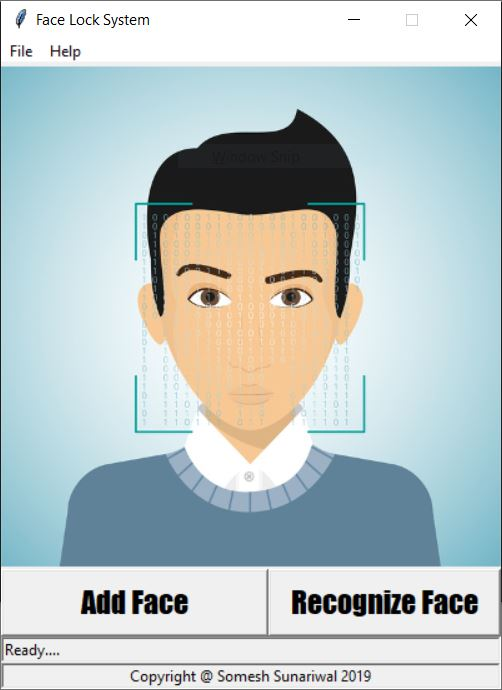
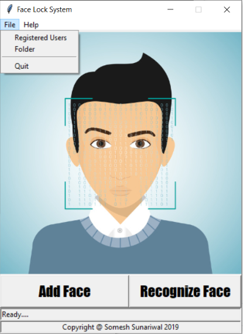
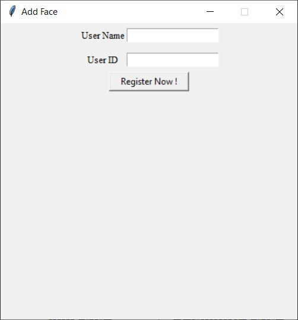
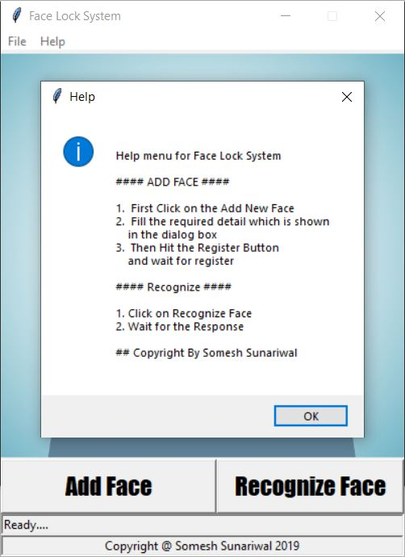

# Face_Lock-demo-GUI-Tkinter-

This is a demo project of face lock and this also demonstrate how a face lock work.

# 1. Start Interface

Before starting the interface go to file menu and click on folder (in case you have no folder name "dataset", "dataset_temp" or so on) to create all required folder    
  
in  order to Recognize the registerd face click on the Recognize in Main GUI window    

Click on Folder to make required Folder  
Click on Register User to know who is register in this GUI  
  

# 2. Add Face
Enter your User_Name and User_ID and Click on Register now and let them app to work.  
Make sure your face is recognize well because this images work as data set in order to train.

# 3. Help
if you want any help click on help and then again click on help and gather some information about acssesing GUI  

